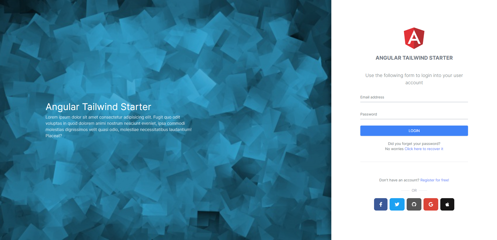
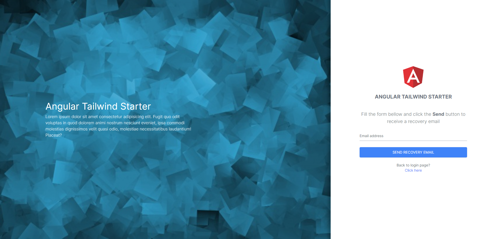
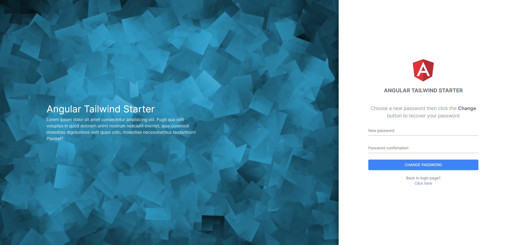

# Angular Tailwind Starter

This is a starter project based on an Angular architecture and TailwindCSS for the design, and many other third party packages.

## Online demo

You can check the online demo of this starter here: [Online demo](https://ng-tailwind-starter.herokuapp.com/auth)

## Documentation

You can find a full documentation here: [Documentation](https://devaslanphp.github.io/ng-tailwind-starter/)

## Screenshots

</img> 
</img> 
</img> 
</img> 
</img> 
</img> 
</img> 

