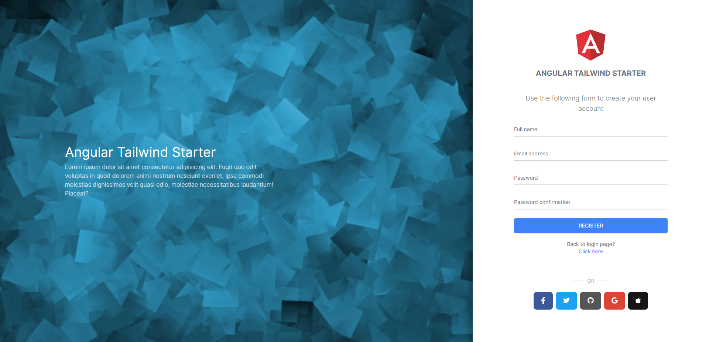
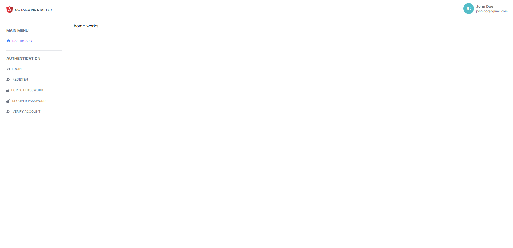

# Pages

This starte project comes with multiple pages, including authentication (login, register, ...), Dashboard, ... and many other pages coming soon.

## Authentication

A complete authentication module is provided by this starter application, containing all the needed pages: Login, Register, Forgot password, Recover password and Verify account pages.

### Login

### Register

### Forgot password

### Recover password

### Verify account

## Dashboard

A Dashboard basic skeletton including `Sidebar`, `Navbar` and `Body`:

## Profile

